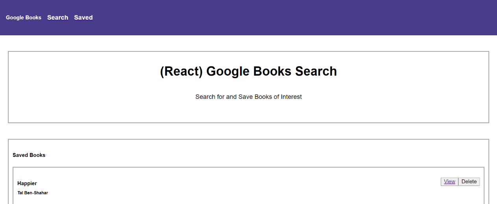
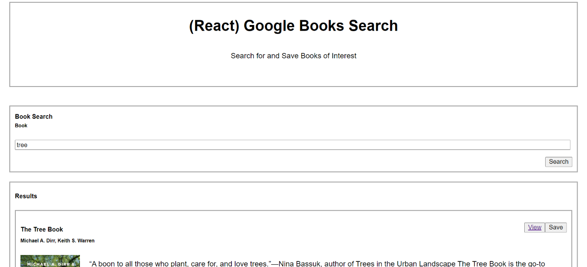
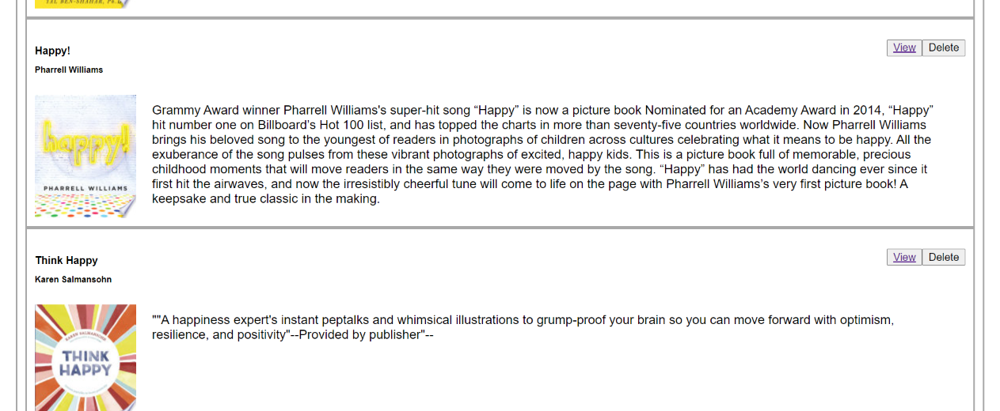
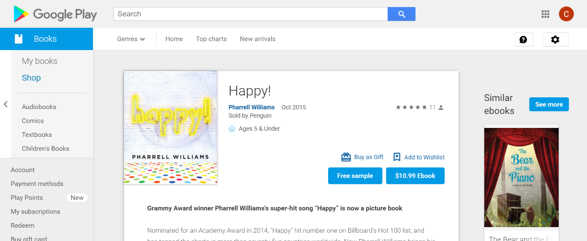

# Google-Books-Search

## Link to Demonstration Video
[Working App Video](https://drive.google.com/file/d/1wGucMyTtvV_fcR3rMtJz8y7VW3HOGVh1/view)

## Descriptions
A MERN app that allows users to search, view, save, and delete books using the Google Books API

## Repository
[Application Repository URL](https://github.com/cmcunningham27/Google-Books-Search)

## Link to Deployed App
[Google Books Search App](https://murmuring-beach-73094.herokuapp.com)

## Table of Contents
- [Project's-aim](#project's-aim)
- [Usage](#usage)
- [Technologies](#technologies)
- [License](#license)
- [Complications](#complications)
- [Features](#features)
- [Questions](#questions)

## Project's aim
Give users the ability to search for books. They can then view more in depth information about a book. If they would like to remember the book for a later read, they can save it on their Saved page. Once they have finished reading the book, and no longer wish for it to remain on their page, they can delete the book from their Saved page.

## Usage
1. Upon visiting the app, scroll down to the search bar and enter the title. Click the Search button.
2. Scroll down to see the results of your search.
3. If you would like to view a more detailed description of a specific book, click the View button in the top right corner of that book's card.
4. If you would like to save the book in your Saved page, click the Save button in the top right corner of the book's card.
5. At the top of the page there is a Nav bar with a link to the Search or Saved page.
6. If you wish to view your Saved books click the word Saved in the Nav bar.
7. Scroll down to view your list.
8. If you wish to view the details for a specific book, click the View button in the top right corner of the book's card.
9. To remove the book from your Saved list, click the Delete button in the top right corner of the book's card.
10. To return to the Search page, click the word Search in the Nav bar at the top of your screen.

## Technologies
* React
* Axios
* CSS
* HTML
* MongoDB
* Node
* Express
* Google Books API

## License
This project is licensed under the MIT license.

## Complications
* Knowing what to put as the parameters and queries in the Google Books API was a struggle at first, but evetually got it figured out.
* I ran into a problem with concurrently. I tried many things to fix it, but the only option that worked was to re-clone the repo in a different location. This resolved the issue, and it no longer came up.
* I do have a node_module on the server side. However, somehow node_modules got added on the client-side. That was not planned. I received help from another person and they said it probably has to do with packages I am using on the front-end. I feel like they should not be there, but they assured me it was ok. 
* React was a bit of a struggle the first few weeks I attempted it. Now, I feel more confident with how to connect React with the back-end in a MERN app. 

## Features
In the future I could add a Read page, so the user can go back and remember what they had read before. Sort of like a bookshelf but with technology. 

## Questions
[GitHub Profile](https://github.com/cmcunningham27)

[E-mail](mailto:sttepstutoring@yahoo.com)

E-mailing me is the best option
